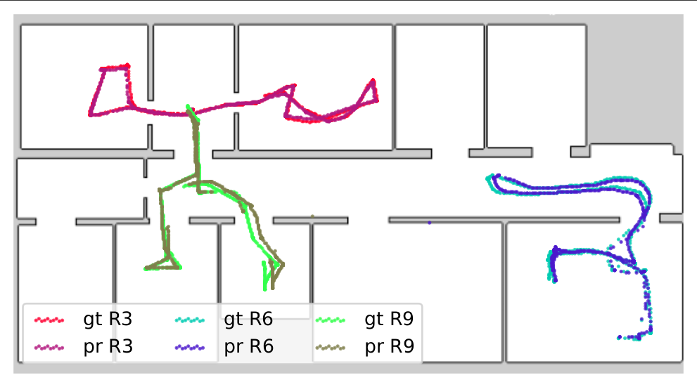

# SIMP: Long-Term Indoor Localization with Metric-Semantic Mapping using a Floor Plan Prior
This repository contains the implementation of the following publication:
```bibtex
@article{zimmerman2023arxiv,
  author = {Zimmerman, Nicky and Sodano, Matteo and Marks, Elias and Behley, Jens and Stachniss, Cyrill},
  title = {{Long-Term Indoor Localization with Metric-Semantic Mapping using a Floor Plan Prior}},
  journal = arxiv,
  year = {2023}
}
```

## Abstract
Object-based maps are relevant for scene understanding since they integrate geometric and semantic information of the environment, allowing autonomous robots to robustly localize and interact with on objects. In this paper, we address the task of constructing a metric-semantic map for the purpose of long-term object-based localization. 
We exploit 3D object detections from monocular RGB frames for both, the object-based map construction, and for globally localizing in the constructed map. To tailor the approach to a target environment, we propose an efficient way of generating 3D annotations to finetune the 3D object detection model.
We evaluate our map construction in an office building, and test our long-term localization approach on challenging sequences recorded in the same environment over nine months. The experiments suggest that our approach is suitable for constructing metric-semantic maps, and that our localization approach is robust to long-term changes. 
Both, the mapping algorithm and the localization pipeline can run online on an onboard computer. 
We will release an open-source C++/ROS implementation of our approach.

## Results
Our live demos for both localization and mapping on the Dingo-O platform can seen in the following video:
[](https://www.youtube.com/watch?v=z5VKtl3Vyyw "SIMP")

The Dingo-O is mounted with Intel NUC10i7FNK and NVidia Jetson Xavier AGX, both running Ubuntu 20.04. Both mapping and localization can be executed onboard of the Dingo.

For the quantitative evaluation, we collected data for 9 months, traversing our entire floor. Our data collection platform is a Kuka YouBot, and we recorded 4 RGB camera streams, ground truth poses and wheel odometry. We used a 30-minutes long sequence to construct an object-based map of our lab, enriching our floor plan with geometric and semantic information. We then localized on challenging sequences, spanning over 9 months, which include dynamics such a humans and changes to the furniture. 
A visualization of our 3D metric-semantic map, and qualitative results for the localization approach evaluated on our map
<p align="center">


</p>


### 3D Object Detection 
We use [Omni3D & Cube R-CNN](https://github.com/FullMetalNicky/omni3d) for object detection, but in theory it can be replaced by any other model that provides our algorithm with class prediction, confidence score and 3D bounding boxes expressed as translation, rotation and scale. Our trained model can be downloaded [here](https://www.ipb.uni-bonn.de/html/projects/simp/model_recent.pth).


## Installation
Requirements:
* ROS 1 - Noetic
* OpenCV 4 
* Eigen
* GTest
* [JSON parser](https://github.com/nlohmann/json)
* Packages - map_server
* [Omni3D & Cube R-CNN](https://github.com/FullMetalNicky/omni3d) (our fork)


Required installations
```bash
sudo apt-get install nlohmann-json3-dev
sudo apt-get install libgtest-dev
sudo apt install libeigen3-dev
sudo apt-get install ros-noetic-map-server
```

First you need to build the ncore library since I don't have a global CMake yet. Tough life. <br/>
```bash
git clone https://gitlab.ipb.uni-bonn.de/nicky.zimmerman/OmniNMCL.git
cd SIMP/ncore
mkdir build && cd build
cmake .. -DBUILD_TESTING=1 
make -j12
```
To see everything is built correctly, run the tests from the build directory
```bash
./bin/NMCLUnitTests
```
To build the ROS wrapper for ROS Noetic
```bash
cd SIMP/ros1_ws
catkin_make
source devel/setup.bash 
```
You will also need to install [Omni3D & Cube R-CNN](https://github.com/FullMetalNicky/omni3d). Please follow the installation guide, and make sure to **activate the cubercnn conda** environment every time you run our code. Place the omni3d folder in `SIMP/ros1_ws/src/` because the ROS nodes are expecting it to be there.

## Running the Algo

We use ROS wrappers to run the algorithm. 

### Omni3DNode
Listens to Image topics, and broadcasts a Float32MultiArray topic, which includes the 3D bounding box, semantic class and confidence score for every detected object.
In our implementation, we sync 4 cameras with 360&deg; FoV coverage, get the prediction for all 4 images, and publishes it as a combined message. 
Omni3DNode.py has a hard-coded path pointing to where ever the Cube R-CNN repository has been cloned to. So make sure to adapt it accordingly.
Parameters: 
* cameraTopics - topic names for 4 cameras (order expected to be front, right, back, left)
* omniTopic - where to publish the 3D object detections
* configPath - location of the model config file (.yaml)
* modelPath - location of the model (.pt)
* jsonPath - path to args.json file which includes information about the cameras extrinsics and intrinsics

The Omni3DNode can be replaced by a user-chosen 3D object detection pipeline, as long as the outputs conform to the format of the our detection message. Each detected objects is represented by 8 3D points corresponding to the corners of the bounding box, a confidence score and the semantic class. Detections are concatenated together as a list of floats (26 floats per object). 

### Omni3DMappingNode
Listens to an Image topic, and broadcasts a Omni3DArray topic, which includes the 3D bounding box, semantic class and confidence score for every detected object.
Omni3DMappingNode.py has a hard-coded path pointing to where ever the Cube R-CNN repository has been cloned to. So make sure to adapt it accordingly.
Parameters: 
* cameraTopic - topic name for camera
* omniTopic - where to publish the 3D object detections
* configPath - location of the model config file (.yaml)
* modelPath - location of the model (.pt)
* jsonPath - path to .json file which includes cameras extrinsics and intrinsics, and algorithm parametrs

The Omni3DMappingNode can be replaced by a user-chosen 3D object detection pipeline, as long as the outputs conform to the format of the our Omni3DArray detection message. This message is an array of Omni3D message, which include the fields center, dim, rot, category and confidence.

### GTNode
Broadcasts PoseStamped messages with the ground truth pose of the robot.
* jsonPath - path to .json file which includes cameras extrinsics and intrinsics, and algorithm parameters
* gtTopic - topic name for ground truth pose
* cameraTopic - topic name for camera
* csvPath - path to csv file with ground truth poses

The GTNode can be replaced by any other pose source, such as VIO.

### SIMPNode
Listens to Omni3DArray and PoseStamped messages, and broadcasts MarkerArray messages that visualize the constructed map in RVIZ.
This node synchronizes the 3D object detections with the robot's current pose to update a metric-semantic map, and is a ROS wrapper around the mapping algorithm in SIMP.py. 
* cameraTopic - topic name for camera
* gtTopic - topic name for ground truth pose
* dumpPath
* jsonPath - path to .json file which includes cameras extrinsics and intrinsics, and algorithm parametrs
The service /dump_map can be used to get a .pickle file of the mapped objects. To run the mapping algorithm 
```bash
roslaunch omni3d_ros omni3d.launch
```

### ConfigNMCLNode
Requires as input 2 topics, Float32MultiArray with 3D object detections and Odometry from VO or wheel encoders. The topic names are configurable through the launch file. This runs the correct and predict steps asynchronously, so correct is executed whenever we have odometry and predict is executed when an observation arrives. ConfigNMCLNodE publishes PoseWithCovarianceStamped messages with the pose prediction. To see the predictions in RVIZ, run
```bash
roslaunch nmcl_ros youbot_localization.launch dataFolder:="path/to/data/folder/"
```

The data folder should have the following items:
* nmcl.config - defines algorithm parameters, like sampling stratgy, motion/observation model, particle number, etc.  
* building.config - defines how many floors there are in the map (only 1 for this code)
* floor.config - defines the map resources:  
  * roomseg.png - pixel-wise annotation associating a pixel with a room number (1, 2, 3...) 
  * Map.yaml (map_server format)
  * Map.png  (map_server format)
  * global_variance.json - stores the semantic, geometric and statistical infromation about the objects in that floor
<br/>
For an example of the content of these files, you can check out [this](ncore/data/floor/GTMap). The data folder contains mostly things that are environment specific, like maps and algorithms definitions. The global_veriance.json is computed using the statistical analysis script. We have only tested this code thoroughly on a signle floor, but it can be potentialy extended to multiple floors. We currently don't have support for multi-floor visualization. Notice that for each floor you'll need its own map resources. 
<br/>


### SemanticMapNode
A visualizer for our abstract semantic maps. 
Parameters: 
* dataset - the path for the dataset.yaml required for YOLO
* dataFolder - as explained above
* mapName 
* markerTopic - where to publish the semantic information

## Pre-Processing Steps

### Labeling Script
New training labels can be generated using NewAutomaticLabeling.py. The generated labels are in Hypersim format and are compatible with what is required to train Cube R-CNN. It requires 3D annotaions of the ground truth objects in the global coordinate system, which are labeled only once, as a pre-processing step. We acquired our ground truth annotations from manually annotating bounding boxes on a pointcloud in [segments.ai](https://segments.ai/). But you can also create annotations but hand-measuring the objects. The format for the ground truth objects is demonstrated in `ros1_ws/src/omni3d_ros/configs/Lab3D-v2.0.json`.
For every posed RGB frame that requires labeling, we also need 2D object detections. We used a YOLOv5 model, that can be downloaded [here](https://www.ipb.uni-bonn.de/html/projects/simp/yolo4omni3d_v0.1.pt).  

### Inference Script
To infer bounding boxes from images, we have the `demo/Predict.py` script in our Cube R-CNN [fork](https://github.com/FullMetalNicky/omni3d) . It outputs the predictions in a format that is compatible with the statistical analysis scripts. 
```bash
python3 demo/Predict.py --config configs/trained_Omni3D.yaml --input-folder "datasets/Omni3D/Hypersim_test.json" --threshold 0.25 MODEL.WEIGHTS your-model.pth
```

### Statistical Analysis
The statistical analysis was computed using ComputeStatsOnPred.py. It requires 3D annotaions of the ground truth objects in the global coordinate system, which are labeled only once, as a pre-processing step. The ground truth objects are matched against a list of detected objects, to provide the desired statistics. The output a file with the per class error variance, which we provide in a .csv format. Given a map (e.g. constructed by Omni3DMappingNode), the script also produces a file with per object error variance , which we provide in a .json and .csn formats.
for generated a correct prediction list, the script from our Omni3d & Cube R-CNN fork can be used.
